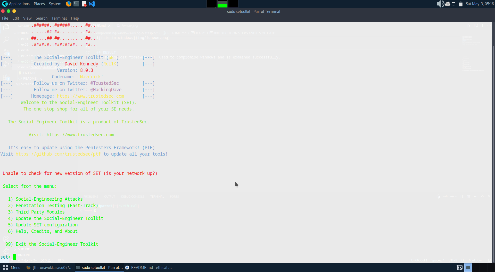

# creating-a-backdoor-with-SET
creating a backdoor with SET - Ethical Hacking Techniques course

# AIM:
To Create a backdoor with Social Engineering Toolkit (SET)

## DESIGN STEPS:

### Step 1:

Install kali linux either in partition or virtual box or in live mode

### Step 2:

Investigate on the various categories of tools as follows:

### Step 3:

Open terminal and try execute some kali linux commands

## EXECUTION STEPS AND ITS OUTPUT:
Social Engineering attacks are the various cons used by the hackers to trick people into providing sensitive data to the attackers. 
The command sudo setoolkit in the prompt gives menu with set prompt:

It displays the following menu and select 2 for Website Attack Vectors:

## RESULT:
The Social Engineering Toolkit (SET) is used to create backdoor is  examined successfully
